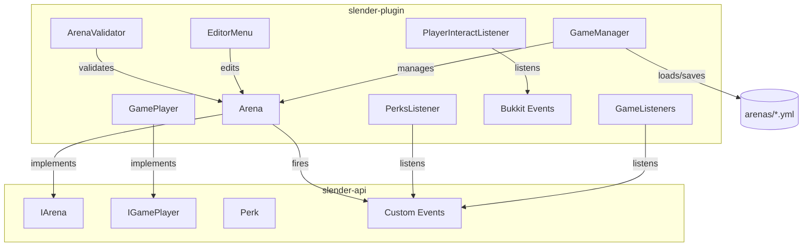

# Design Document: Slender Minigame Overhaul

## Overview

Este documento describe el diseño técnico para la revisión del plugin "Stop It Slender" (Bukkit/Spigot, Java). El alcance cubre la corrección de 6 bugs críticos y la implementación de 4 nuevas funcionalidades, todas dentro de la arquitectura existente del plugin sin introducir dependencias externas nuevas.

El plugin sigue una arquitectura de capas: `slender-api` expone interfaces públicas (`IArena`, `IGamePlayer`, `Perk`) y `slender-plugin` contiene las implementaciones concretas. Los componentes clave son `Arena` (lógica de partida), `GameManager` (ciclo de vida de arenas), `GameListeners` / `PlayerInteractListener` (eventos Bukkit), y `EditorMenu` (UI de administración).

---

## Architecture



### Flujo de corrección de bugs

Cada bug se corrige en su componente de origen sin cambiar interfaces públicas:

| Bug | Componente | Tipo de fix |
|-----|-----------|-------------|
| `spawnPage()` crash con lista vacía | `Arena` | Guard clause |
| BLINDNESS `Integer.MAX_VALUE` | `Arena.sendPlayersToGame()` | Cambio de constante |
| `radiusTask` NPE en `endGame()` | `Arena.endGame()` | Null check |
| Pickup remueve item antes de verificar rol | `GameListeners` | Reordenar lógica |
| Brújula usa `findAny()` en vez de mínimo | `PlayerInteractListener` | Cambio de stream |
| `maxPlayers=0` al cargar YAML | `GameManager.loadGame()` | Valor por defecto |
| `getAvailableArena()` usa `!=` | `GameManager` | Cambio de operador |
| Sin límites mínimos en EditorMenu | `EditorMenu` | Guard en click handler |

---

## Components and Interfaces

### ArenaValidator (nuevo)

Clase utilitaria estática que centraliza todas las validaciones de configuración de arena. Se invoca desde `GameManager.saveGame()`, `Arena.start()`, y `EditorMenu`.

```java
public class ArenaValidator {
    /**
     * Valida la configuración de una arena antes de guardar o iniciar.
     * @return lista de mensajes de error; vacía si la configuración es válida.
     */
    public static List<String> validate(Arena arena) { ... }

    /**
     * Valida que haya suficientes spawn points para los supervivientes actuales.
     */
    public static List<String> validateForStart(Arena arena) { ... }
}
```

### Arena (modificaciones)

**`spawnPage()`** — añadir guard clause al inicio:
```java
if (getPagesLocations().isEmpty()) {
    Util.sendPluginMessage("&c[SlenderMan] Error: No hay ubicaciones de páginas configuradas.");
    return;
}
```

**`sendPlayersToGame()`** — corregir BLINDNESS:
```java
// Antes: new PotionEffect(PotionEffectType.BLINDNESS, Integer.MAX_VALUE, Integer.MAX_VALUE)
// Después:
player.addPotionEffect(new PotionEffect(PotionEffectType.BLINDNESS, 100, 0));
```

**`endGame()`** — corregir NPE en radiusTask:
```java
// Antes: this.radiusTask.cancel();
// Después:
if (this.radiusTask != null) {
    this.radiusTask.cancel();
}
```

**`start()`** — añadir validación previa:
```java
List<String> errors = ArenaValidator.validateForStart(this);
if (!errors.isEmpty()) {
    errors.forEach(this::sendMessage);
    setArenaState(ArenaState.WAITING);
    return;
}
```

**Efectos al recoger páginas** — añadir en `GameListeners.pickupEvent()` tras incrementar contador:
```java
// Sonido personal
player.playSound(player.getLocation(), Sound.ENTITY_EXPERIENCE_ORB_PICKUP, 1f, 1f);
// Título personal
player.sendTitle("", "Página " + arena.getCollectedPages() + "/8", 5, 30, 5);
// Sonido broadcast
arena.getPlayers().keySet().forEach(p ->
    p.playSound(p.getLocation(), Sound.BLOCK_NOTE_BLOCK_PLING, 1f, 1f));
// Sonido final
if (arena.getCollectedPages() == 8) {
    arena.getPlayers().keySet().forEach(p ->
        p.playSound(p.getLocation(), Sound.UI_TOAST_CHALLENGE_COMPLETE, 1f, 1f));
}
```

### GameListeners (modificaciones)

**`pickupEvent()`** — reordenar verificación de rol ANTES de remover el item:

```java
@EventHandler
public void pickupEvent(PlayerPickupItemEvent event) {
    event.setCancelled(true);                          // siempre cancelar el pickup nativo
    GamePlayer gamePlayer = ...;
    if (!gamePlayer.isInArena()) return;
    Arena arena = (Arena) gamePlayer.getArena();

    // VERIFICAR ROL PRIMERO
    if (arena.getPlayers().get(gamePlayer.getPlayer()) != Role.SURVIVOR) return;

    // Solo si es SURVIVOR: remover item y procesar
    event.getItem().remove();
    ...
}
```

### PlayerInteractListener (modificaciones)

**Brújula** — reemplazar `findAny()` por cálculo de mínimo euclidiano + null check en `gamePlayer.getArena()`:

```java
if (itemStack.getType() == Material.COMPASS) {
    event.setCancelled(true);
    if (gamePlayer.getArena() == null) return;   // null check

    Player slender = player;
    Player nearest = gamePlayer.getArena().getPlayers().entrySet().stream()
        .filter(e -> e.getValue() == Role.SURVIVOR)
        .map(Map.Entry::getKey)
        .min(Comparator.comparingDouble(p -> p.getLocation().distanceSquared(slender.getLocation())))
        .orElse(null);

    if (nearest == null) {
        player.sendMessage(Langauge.COMPASS_NO_SURVIVORS.toString());
        return;
    }
    player.setCompassTarget(nearest.getLocation());
    player.playSound(player.getLocation(), Sound.ENTITY_ENDERMAN_TELEPORT, 1f, 1f);
}
```

### GameManager (modificaciones)

**`loadGame()`** — valores por defecto para min/maxPlayers:
```java
int maxPlayers = configuration.getInt("GameSettings.MaxPlayers");
if (maxPlayers <= 0) {
    maxPlayers = 8;
    Util.sendPluginMessage("&e[SlenderMan] Advertencia: MaxPlayers no configurado, usando 8.");
}
arena.setMaxPlayers(maxPlayers);

int minPlayers = configuration.getInt("GameSettings.MinPlayers");
if (minPlayers <= 0) {
    minPlayers = 2;
    Util.sendPluginMessage("&e[SlenderMan] Advertencia: MinPlayers no configurado, usando 2.");
}
arena.setMinPlayers(minPlayers);
```

**`getAvailableArena()`** — cambiar `!=` por `<`:
```java
.filter(arena -> !arena.isRunning() && arena.getPlayers().size() < arena.getMaxPlayers())
```

**`saveGame()`** — invocar `ArenaValidator` antes de persistir:
```java
public void saveGame(Arena arena, @Nullable Player admin) {
    List<String> errors = ArenaValidator.validate(arena);
    if (!errors.isEmpty()) {
        if (admin != null) errors.forEach(admin::sendMessage);
        return;
    }
    // ... lógica de guardado existente
}
```

### EditorMenu (modificaciones)

Añadir límites mínimos en los casos `MINIMUM_PLAYERS` y `MAXIMUM_PLAYERS`:

```java
case MINIMUM_PLAYERS:
    if (event.getClicktype().isLeftClick()) {
        int next = arena.getMinPlayers() + 1;
        if (next <= arena.getMaxPlayers())          // no superar maxPlayers
            arena.setMinPlayers(next);
    } else {
        if (arena.getMinPlayers() > 1)              // límite inferior: 1
            arena.setMinPlayers(arena.getMinPlayers() - 1);
    }
    new EditorMenu(arena).open(event.getPlayer());
    break;

case MAXIMUM_PLAYERS:
    if (event.getClicktype().isLeftClick()) {
        arena.setMaxPlayers(arena.getMaxPlayers() + 1);
    } else {
        if (arena.getMaxPlayers() > 2)              // límite inferior: 2
            arena.setMaxPlayers(arena.getMaxPlayers() - 1);
    }
    new EditorMenu(arena).open(event.getPlayer());
    break;
```

### Sistema de Perks (activación)

El sistema de perks ya tiene la infraestructura en `slender-api` (`Perk`, `PerkInfo`, `IGamePlayer.setPerk/getPerk`) y las implementaciones en `game/perks/`. Solo falta:

1. **`GamePlayer`**: implementar `setPerk` / `getPerk` con un `Map<Role, Perk>`.
2. **`Arena.sendPlayersToGame()`**: descomentar las líneas que entregan el item del perk en slot 4.
3. **`PlayerInteractListener`**: añadir handler para click derecho en slot 4 que llame `perk.usePerk(player)`.
4. **`Arena.endGame()`**: limpiar efectos de perks (ya se limpian todos los efectos de poción con `removePotionEffect`).

---

## Data Models

### Arena (estado en memoria)

```
Arena {
  id: String                          // nombre del archivo YAML sin extensión
  minPlayers: int                     // >= 1, default 2
  maxPlayers: int                     // >= 2, default 8, >= minPlayers
  gameTime: int                       // segundos totales de partida
  timer: int                          // contador regresivo actual
  slenderManSpawnLocation: Location   // nullable hasta configurar
  survivorsLocations: List<Location>  // >= 1 para poder iniciar
  pagesLocations: List<Location>      // >= 1 para poder iniciar
  arenaState: ArenaState              // WAITING | STARTING | RUNNING | ENDING | RESTARTING
  players: Map<Player, Role>          // jugadores actuales y sus roles
  slenderMan: Player                  // nullable fuera de RUNNING
  collectedPages: int                 // 0..8
  radiusTask: BukkitTask              // nullable si USE_TERROR_RADIUS=false
}
```

### Invariantes de configuración

- `minPlayers >= 1`
- `maxPlayers >= 2`
- `minPlayers <= maxPlayers`
- `pagesLocations.size() >= 1` para iniciar
- `survivorsLocations.size() >= survivorCount` para iniciar
- `slenderManSpawnLocation != null` para iniciar

### GamePlayer (extensión para perks)

```
GamePlayer {
  ...existente...
  perks: Map<Role, Perk>   // Role.SURVIVOR -> perk de superviviente
                            // Role.SLENDER  -> perk de slenderman
}
```

`getPerk(role)` retorna `null` si no hay perk equipado; el código de entrega en `sendPlayersToGame()` debe verificar null y omitir si es null (o usar un perk `NONE` que no hace nada).

### YAML de arena (sin cambios de esquema)

```yaml
GameSettings:
  Time: 600
  MinPlayers: 2       # default 2 si ausente o 0
  MaxPlayers: 8       # default 8 si ausente o 0
  SlenderStartLocation: "x:y:z:pitch:yaw:world"
  SurvivorsLocations:
    - "x:y:z:pitch:yaw:world"
  PagesLocations:
    - "x:y:z:pitch:yaw:world"
```

---

## Correctness Properties

*A property is a characteristic or behavior that should hold true across all valid executions of a system — essentially, a formal statement about what the system should do. Properties serve as the bridge between human-readable specifications and machine-verifiable correctness guarantees.*

### Property 1: spawnPage con lista no vacía dropea en ubicación de la lista

*For any* arena con una lista de `pagesLocations` no vacía, cuando se invoca `spawnPage()`, el item dropeado debe encontrarse en una de las ubicaciones de la lista.

**Validates: Requirements 1.2**

---

### Property 2: Non-SURVIVOR no puede remover páginas del mundo

*For any* jugador con rol distinto a `SURVIVOR` (SLENDER, SPECTATOR, NONE) que intente recoger un item de página, el item debe seguir existiendo en el mundo después del intento.

**Validates: Requirements 2.1, 2.2, 2.4**

---

### Property 3: SURVIVOR incrementa contador al recoger página

*For any* arena en estado RUNNING y cualquier jugador con rol `SURVIVOR`, recoger una página debe incrementar `collectedPages` en exactamente 1.

**Validates: Requirements 2.3**

---

### Property 4: Valores por defecto al cargar YAML con campos ausentes o cero

*For any* archivo YAML de arena donde `MaxPlayers` sea 0 o esté ausente, el valor cargado en la arena debe ser 8; y donde `MinPlayers` sea 0 o esté ausente, el valor cargado debe ser 2.

**Validates: Requirements 3.1, 3.2**

---

### Property 5: Invariante minPlayers <= maxPlayers en EditorMenu

*For any* secuencia de operaciones de incremento/decremento en `EditorMenu`, siempre debe cumplirse `minPlayers <= maxPlayers` y `minPlayers >= 1` y `maxPlayers >= 2`.

**Validates: Requirements 3.3, 3.4, 3.5**

---

### Property 6: getAvailableArena excluye arenas llenas

*For any* arena donde `players.size() >= maxPlayers`, `getAvailableArena()` no debe retornar esa arena.

**Validates: Requirements 3.6**

---

### Property 7: BLINDNESS inicial tiene duración 100 ticks y amplifier 0

*For any* jugador con rol `SURVIVOR` después de que `start()` es invocado, el efecto `BLINDNESS` activo debe tener `duration <= 100` y `amplifier == 0`.

**Validates: Requirements 4.1, 4.2**

---

### Property 8: Arena inválida no se guarda ni inicia

*For any* arena donde alguna de las siguientes condiciones sea verdadera: `slenderManSpawnLocation == null`, `survivorsLocations.isEmpty()`, `pagesLocations.isEmpty()`, o `maxPlayers < minPlayers`; tanto `saveGame()` como `start()` deben cancelar la operación sin persistir cambios ni cambiar el estado a RUNNING.

**Validates: Requirements 8.1, 8.2, 8.3, 8.4, 10.1, 10.2, 10.3**

---

### Property 9: Arena válida se puede guardar y recargar con los mismos valores

*For any* arena con configuración válida, guardarla con `saveGame()` y luego cargarla con `loadGame()` debe producir una arena con los mismos valores de `minPlayers`, `maxPlayers`, `gameTime`, `slenderManSpawnLocation`, `survivorsLocations` y `pagesLocations`.

**Validates: Requirements 8.5**

---

### Property 10: Perk por defecto es NONE cuando no hay perk equipado

*For any* `GamePlayer` que no haya equipado un perk para un rol dado, `getPerk(role)` debe retornar `null` o un perk cuyo `usePerk()` no tenga efectos observables.

**Validates: Requirements 9.5**

---

### Property 11: Perk item en slot 4 tras start()

*For any* jugador con un perk equipado (no null) al momento de `start()`, el slot 4 de su inventario debe contener el item correspondiente al perk.

**Validates: Requirements 9.2**

---

### Property 12: Estado WAITING tras fallo de validación en start()

*For any* arena inválida donde `start()` es invocado, el estado de la arena después de la llamada debe ser `ArenaState.WAITING`.

**Validates: Requirements 10.4**

---

### Property 13: Brújula apunta al superviviente con menor distancia euclidiana

*For any* conjunto de supervivientes con posiciones conocidas y un Slenderman en una posición dada, el target de la brújula después de usar el item debe ser la ubicación del superviviente cuya distancia al cuadrado al Slenderman sea mínima.

**Validates: Requirements 7.1, 7.2**

---

### Property 14: Título de página contiene el número correcto

*For any* valor de `collectedPages` entre 1 y 8, el título enviado al superviviente al recoger una página debe contener la cadena `collectedPages + "/8"`.

**Validates: Requirements 6.2**

---

## Error Handling

| Situación | Componente | Comportamiento |
|-----------|-----------|----------------|
| `pagesLocations` vacía en `spawnPage()` | `Arena` | Log de error en consola, retorno inmediato sin excepción |
| `radiusTask == null` en `endGame()` | `Arena` | Null check, continuar ejecución |
| `gamePlayer.getArena() == null` en brújula | `PlayerInteractListener` | Retorno inmediato |
| Arena inválida en `saveGame()` | `GameManager` + `ArenaValidator` | Mensajes de error al admin, no persistir |
| Arena inválida en `start()` | `Arena` + `ArenaValidator` | Mensajes a todos los jugadores, estado → WAITING |
| `maxPlayers=0` en YAML | `GameManager.loadGame()` | Valor por defecto 8, advertencia en consola |
| `minPlayers=0` en YAML | `GameManager.loadGame()` | Valor por defecto 2, advertencia en consola |
| Jugador sin arena intenta usar brújula | `PlayerInteractListener` | Null check en `getArena()`, retorno silencioso |
| No hay supervivientes al usar brújula | `PlayerInteractListener` | Mensaje al Slenderman, sin crash |

---

## Testing Strategy

### Enfoque dual

Se utilizan dos tipos de tests complementarios:

- **Unit tests**: verifican ejemplos concretos, casos borde y condiciones de error.
- **Property tests**: verifican propiedades universales sobre rangos amplios de inputs generados.

Los unit tests cubren casos específicos que son difíciles de generar aleatoriamente (e.g., estado exacto del servidor Bukkit). Los property tests cubren invariantes que deben mantenerse para cualquier input válido.

### Librería de property-based testing

Para Java/Bukkit se usará **[jqwik](https://jqwik.net/)** (versión 1.8+), que integra con JUnit 5 y permite definir generadores de datos arbitrarios. Cada property test debe ejecutarse con mínimo **100 iteraciones** (`@Property(tries = 100)`).

### Configuración de mocks

Dado que Bukkit requiere un servidor activo, los tests usarán **MockBukkit** para simular el entorno del servidor sin necesidad de levantar una instancia real.

### Unit tests (ejemplos y casos borde)

| Test | Clase | Cubre |
|------|-------|-------|
| `spawnPage_emptyList_doesNotThrow` | `ArenaTest` | Req 1.1, edge-case |
| `endGame_radiusTaskNull_doesNotThrow` | `ArenaTest` | Req 5.1, edge-case |
| `compass_noSurvivors_sendsMessage` | `PlayerInteractListenerTest` | Req 7.3, edge-case |
| `saveGame_validArena_persists` | `GameManagerTest` | Req 8.5, example |
| `editorMenu_save_invokesValidator` | `EditorMenuTest` | Req 8.6, example |
| `perk_usePerk_calledOnRightClick` | `PlayerInteractListenerTest` | Req 9.3/9.4, example |
| `allPages_collected_callsEndGame` | `GameListenersTest` | Req 6.4, example |

### Property tests

Cada property test referencia la propiedad del diseño con el tag:
`// Feature: slender-minigame-overhaul, Property N: <texto>`

```java
// Feature: slender-minigame-overhaul, Property 1: spawnPage dropea en ubicación de la lista
@Property(tries = 100)
void spawnPage_dropsItemAtListLocation(@ForAll List<@From("validLocations") Location> locations) {
    // Arrange: arena con pagesLocations = locations (no vacía)
    // Act: arena.spawnPage()
    // Assert: item dropeado está en una de las locations
}

// Feature: slender-minigame-overhaul, Property 2: Non-SURVIVOR no remueve páginas
@Property(tries = 100)
void nonSurvivor_cannotPickupPage(@ForAll @From("nonSurvivorRoles") Role role) {
    // Arrange: jugador con rol != SURVIVOR, item de página en el mundo
    // Act: disparar PlayerPickupItemEvent
    // Assert: item.isValid() == true (no fue removido)
}

// Feature: slender-minigame-overhaul, Property 3: SURVIVOR incrementa contador
@Property(tries = 100)
void survivor_pickupPage_incrementsCounter(@ForAll int initialPages) {
    // Arrange: arena con collectedPages = initialPages (0..7)
    // Act: SURVIVOR recoge página
    // Assert: collectedPages == initialPages + 1
}

// Feature: slender-minigame-overhaul, Property 4: Valores por defecto YAML
@Property(tries = 100)
void loadGame_zeroOrMissingPlayers_usesDefaults(@ForAll int rawMax, @ForAll int rawMin) {
    // Arrange: YAML con MaxPlayers=rawMax (<=0), MinPlayers=rawMin (<=0)
    // Act: loadGame()
    // Assert: arena.getMaxPlayers() == 8, arena.getMinPlayers() == 2
}

// Feature: slender-minigame-overhaul, Property 5: Invariante minPlayers <= maxPlayers
@Property(tries = 100)
void editorMenu_operations_maintainInvariant(@ForAll List<@From("editorOps") EditorOp> ops) {
    // Arrange: arena con valores iniciales válidos
    // Act: aplicar secuencia de operaciones
    // Assert: minPlayers <= maxPlayers && minPlayers >= 1 && maxPlayers >= 2
}

// Feature: slender-minigame-overhaul, Property 6: getAvailableArena excluye arenas llenas
@Property(tries = 100)
void getAvailableArena_excludesFullArenas(@ForAll int maxPlayers, @ForAll int currentPlayers) {
    // Arrange: arena con maxPlayers jugadores actuales
    // Act: getAvailableArena()
    // Assert: arena llena no está en el resultado
}

// Feature: slender-minigame-overhaul, Property 7: BLINDNESS amplifier 0
@Property(tries = 100)
void start_survivorBlindness_amplifierZero(@ForAll List<@From("players") Player> survivors) {
    // Arrange: arena con supervivientes
    // Act: start()
    // Assert: todos los SURVIVOR tienen BLINDNESS con amplifier==0 y duration<=100
}

// Feature: slender-minigame-overhaul, Property 8: Arena inválida no se guarda
@Property(tries = 100)
void saveGame_invalidArena_doesNotPersist(@ForAll @From("invalidArenas") Arena arena) {
    // Arrange: arena con configuración inválida
    // Act: saveGame()
    // Assert: archivo no fue modificado / creado
}

// Feature: slender-minigame-overhaul, Property 9: Round-trip guardar/cargar
@Property(tries = 100)
void saveAndLoad_validArena_preservesValues(@ForAll @From("validArenas") Arena arena) {
    // Arrange: arena válida
    // Act: saveGame() luego loadGame()
    // Assert: todos los campos coinciden
}

// Feature: slender-minigame-overhaul, Property 13: Brújula apunta al más cercano
@Property(tries = 100)
void compass_pointsToNearestSurvivor(@ForAll List<@From("players") Player> survivors,
                                      @ForAll @From("locations") Location slenderLoc) {
    // Arrange: supervivientes en posiciones aleatorias, slender en slenderLoc
    // Act: usar brújula
    // Assert: compassTarget == ubicación del superviviente con menor distanceSquared
}

// Feature: slender-minigame-overhaul, Property 14: Título contiene número correcto
@Property(tries = 100)
void pagePickup_title_containsCorrectCount(@ForAll @IntRange(min=1, max=8) int pages) {
    // Arrange: arena con collectedPages = pages
    // Act: SURVIVOR recoge página (collectedPages pasa a pages)
    // Assert: título enviado contiene pages + "/8"
}
```
